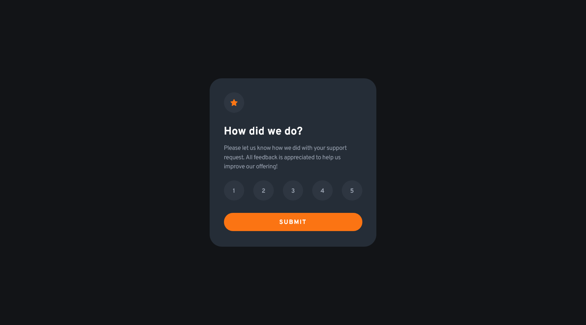
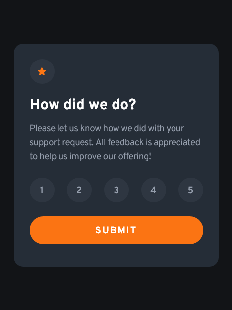

# Frontend Mentor - Interactive rating component solution

This is a solution to the [Interactive rating component challenge on Frontend Mentor](https://www.frontendmentor.io/challenges/interactive-rating-component-koxpeBUmI). Frontend Mentor challenges help you improve your coding skills by building realistic projects. 

## Table of contents

- [Overview](#overview)
  - [The challenge](#the-challenge)
  - [Screenshot](#screenshot)
  - [Links](#links)
- [My process](#my-process)
  - [Built with](#built-with)
  - [Useful resources](#useful-resources)
- [Author](#author)

## Overview

### The challenge

Users should be able to:

- View the optimal layout for the app depending on their device's screen size
- See hover states for all interactive elements on the page
- Select and submit a number rating
- See the "Thank you" card state after submitting a rating

### Screenshot

### Links

- Solution URL: [https://github.com/coderwww/Mentor-Interactive-rating-component-React](https://github.com/coderwww/Mentor-Interactive-rating-component-React)
- Live Site URL: [https://coderwww.github.io/Mentor-Interactive-rating-component-React](https://coderwww.github.io/Mentor-Interactive-rating-component-React)

## My process

### Built with

- Semantic HTML5 markup
- SCSS
- BEM
- Mobile-first workflow
- [React](https://reactjs.org/) - JS library

### Useful resources

- [How to Deploy React App to GitHub Pages](https://www.c-sharpcorner.com/article/how-to-deploy-react-application-on-github-pages/) - This helped me to Deploy React App to GitHub Pages. I really liked this pattern and will use it going forward.
- [Deploying a React App* to GitHub Pages](https://github.com/gitname/react-gh-pages) - This is an amazing article which helped me to Deploy React App to GitHub Pages. I'd recommend it to anyone still learning this concept.

## Author

- Website - [https://coderwww.github.io](https://coderwww.github.io)
- Frontend Mentor - [@coderwww](https://www.frontendmentor.io/profile/coderwww)

